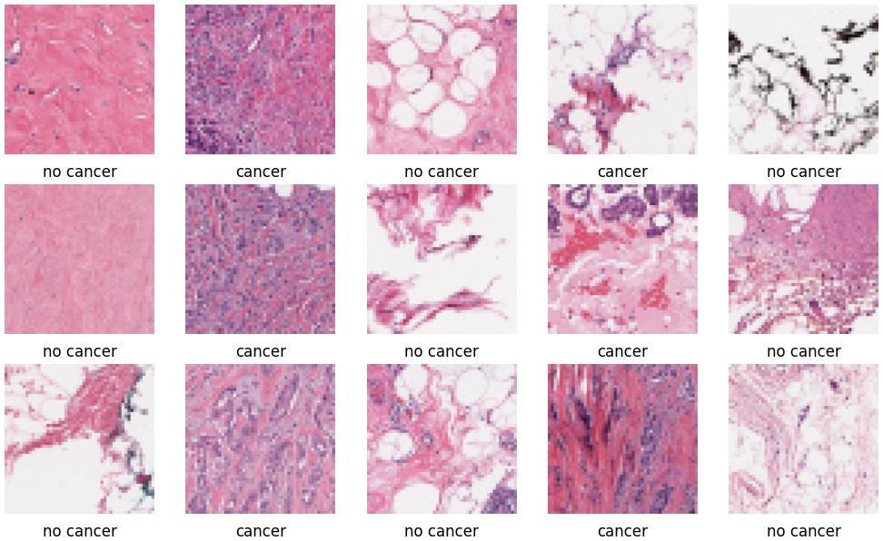
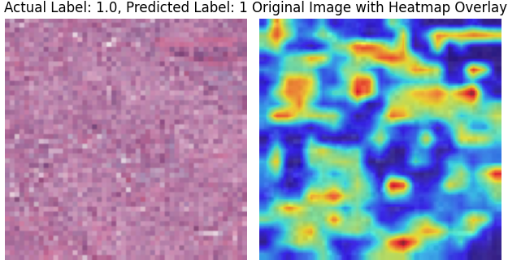
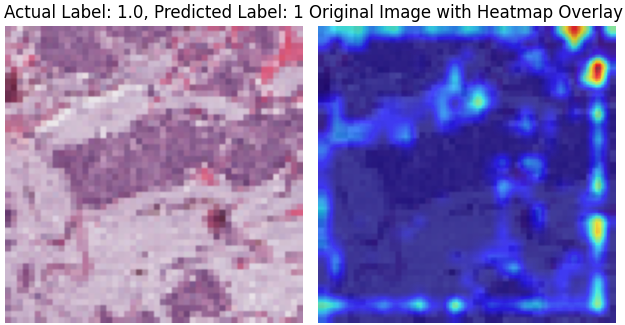

<a>
# Breast Cancer Detector

The Breast Cancer Detector is a machine learning Jupyter report. The classifications models take a 50 x 50 pixel image of breast tissue and then classify areas of cancer, returning back if the patient has cancer or not. Included in the report is a heat map that shows where cancer is detected in the image.

## How to run

Install Jupyter onto you machine and open breastcancer_final with Jupyter. 

## Examples of Breast Cancer Detector

</a>
